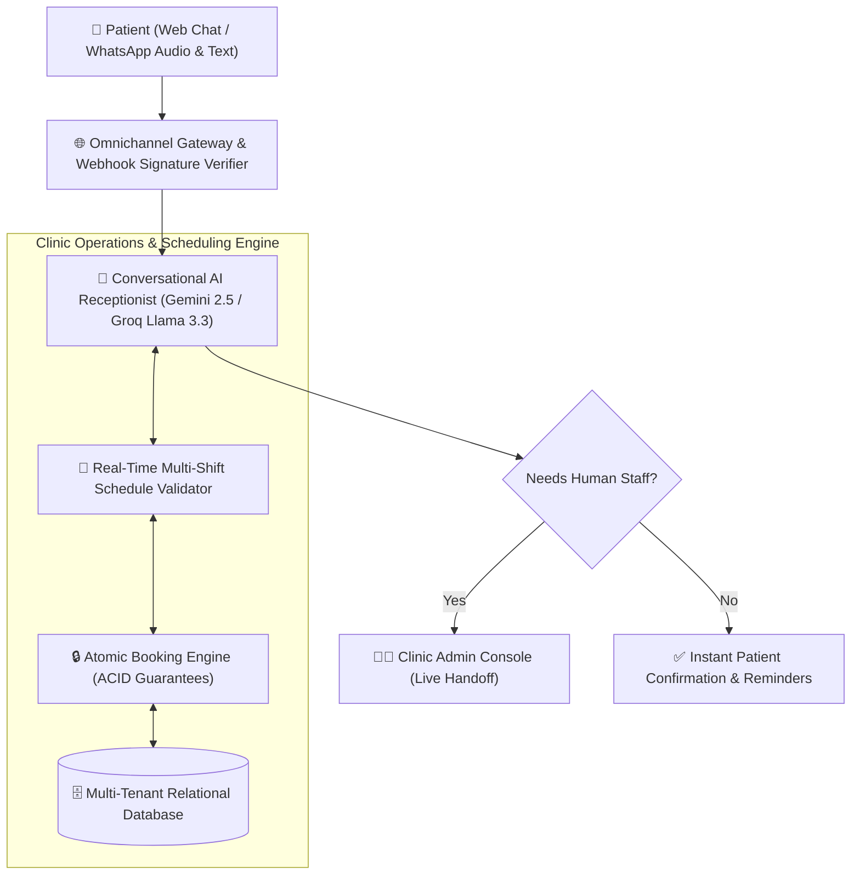
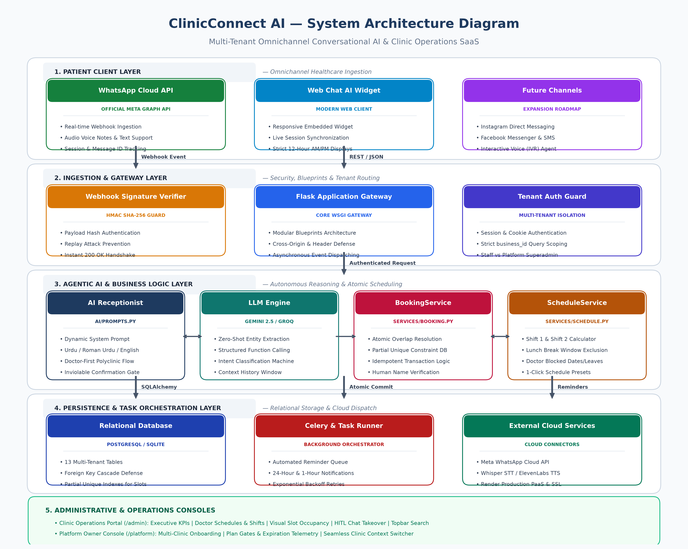
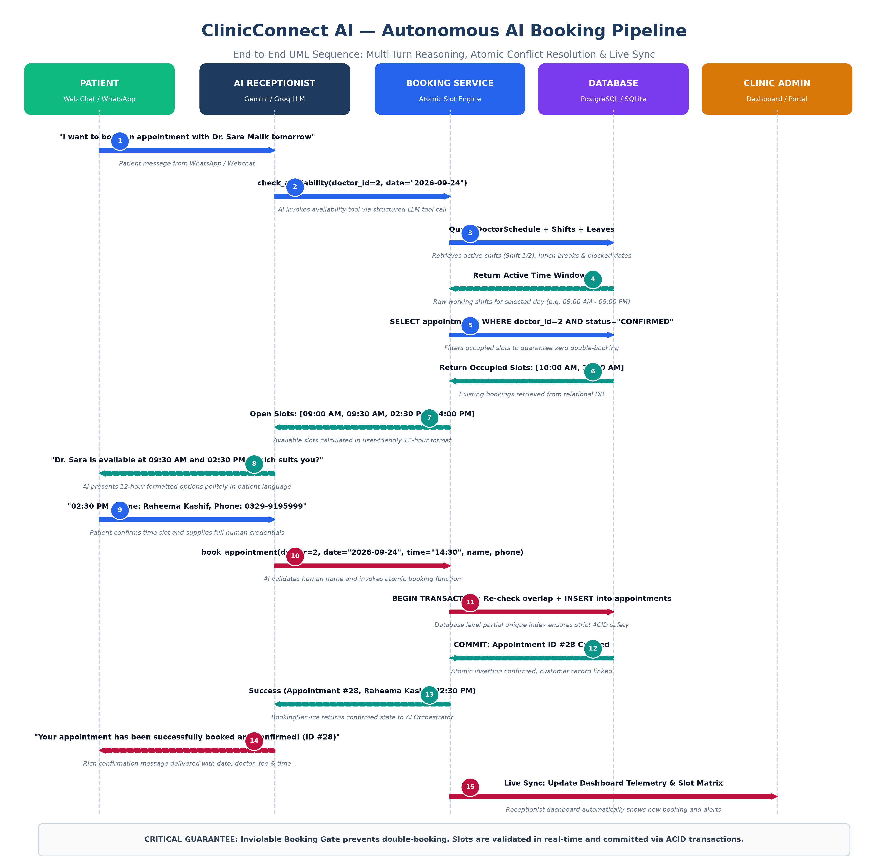
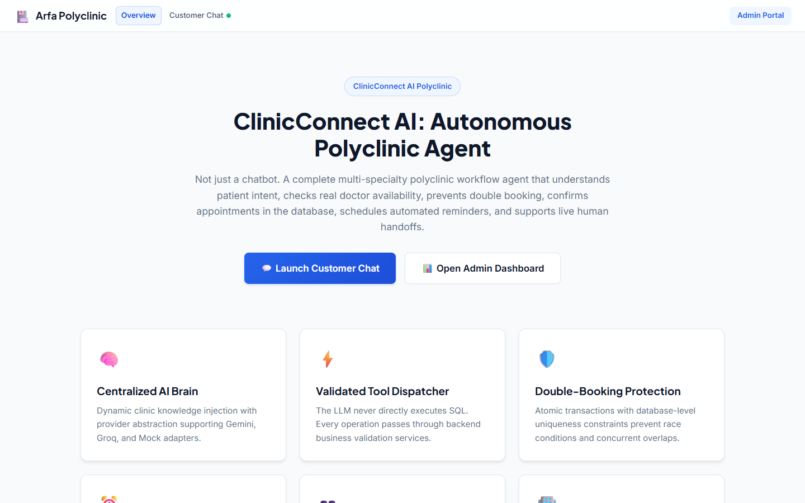
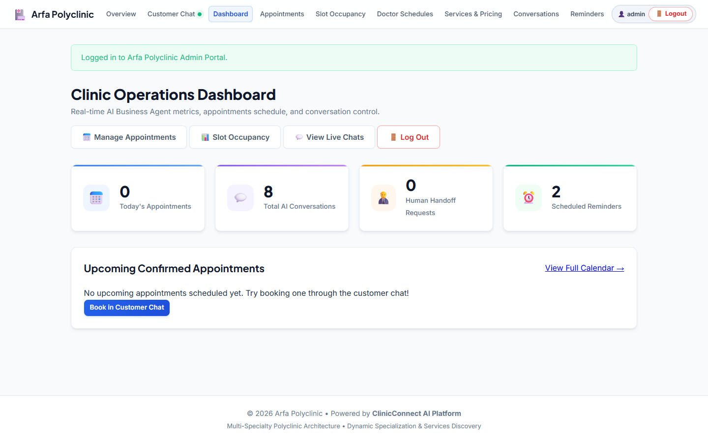
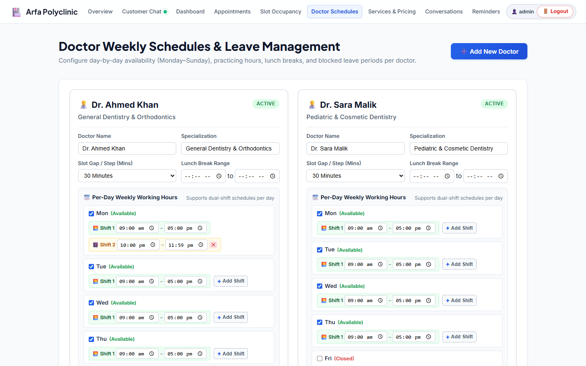
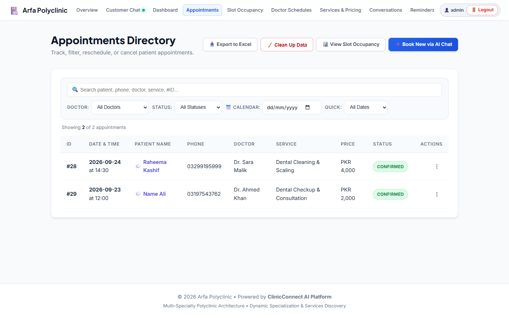
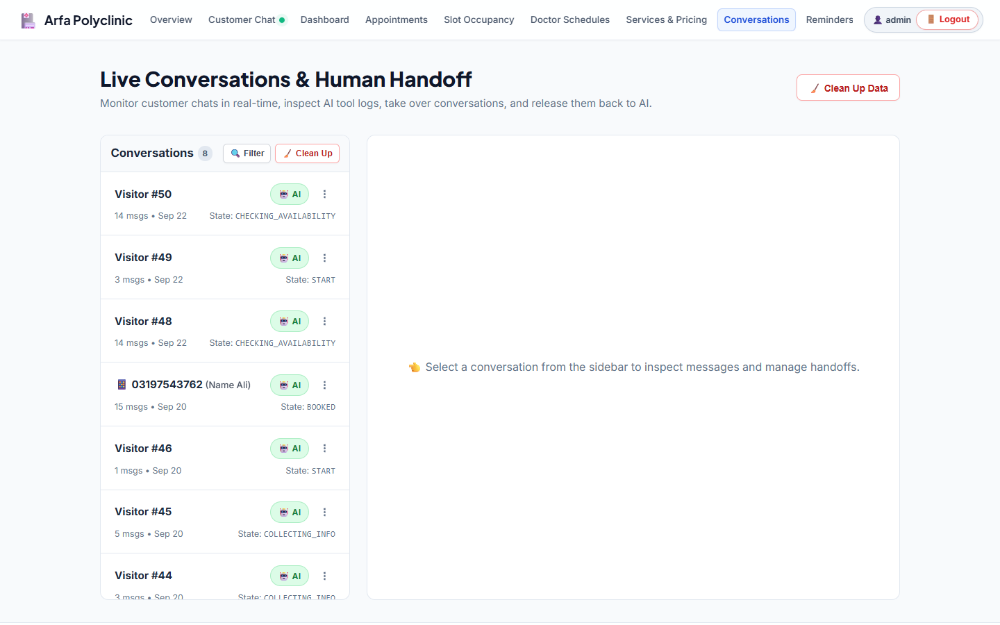
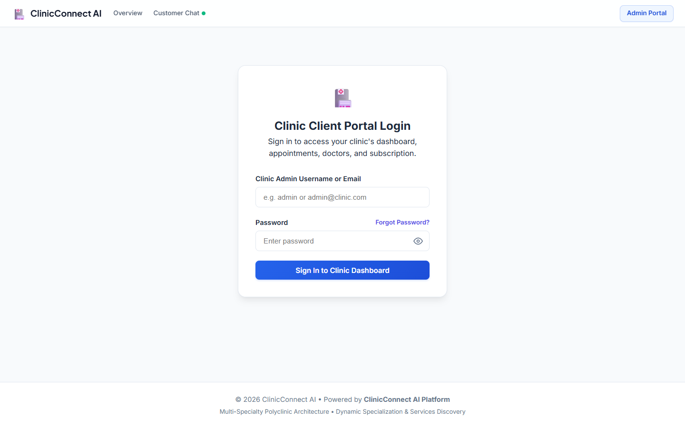

# ClinicConnect AI — Autonomous AI Receptionist Platform

> **A multi-tenant healthcare SaaS platform that deploys an autonomous 24/7 AI receptionist across Web Chat and WhatsApp to handle patient inquiries, doctor scheduling, and appointment booking with zero human friction.**

---

## 📌 Executive Pitch & Problem Statement

### The Problem
Traditional outpatient clinics, dental centers, diagnostic labs, and polyclinics lose up to **35% of potential appointments** due to missed calls after hours, long front-desk phone queues, manual scheduling mix-ups, and repetitive patient questions regarding doctor availability, fees, and location. Front-desk staff are overwhelmed by routine inquiries instead of caring for in-clinic patients, leading to administrative burn-out and lost clinic revenue.

### The Solution: ClinicConnect AI
**ClinicConnect AI** is an enterprise-grade, multi-tenant SaaS platform that acts as a clinic's tireless, conversational front-desk receptionist. Operating simultaneously across **Web Chat** and **official Meta WhatsApp Cloud API**, the agent answers patient questions in English, Urdu, or Roman Urdu, checks doctor schedules dynamically, guides patients through a structured booking flow, prevents double-booking via atomic database transactions, and sends real-time confirmations. When human intervention is required, the system seamlessly hands over the conversation to clinic personnel with full contextual history.

---

## 🧠 How the AI Receptionist Works (In Plain Language)

Rather than relying on brittle decision trees or robotic keyword bots, ClinicConnect AI leverages modern **Agentic LLM Reasoning**:

1. **Multilingual Ingestion:** A patient reaches out via the clinic's website widget or WhatsApp. They can type naturally or send voice notes in English, Urdu, or colloquial Roman Urdu.
2. **Intent & Entity Extraction:** The AI receptionist parses the patient's intent (e.g., inquiry about consultation fees, asking which cardiologist is on duty, requesting to reschedule, or requesting a consultation).
3. **Real-Time Schedule Validation:** When a patient asks for a doctor or appointment slot, the agent coordinates directly with the clinic's calendar engine to check exact doctor availability, multi-shift timings, lunch breaks, and existing bookings.
4. **Authoritative Slot Confirmation:** The agent proposes available 12-hour formatted time slots. The patient selects a slot, provides their name and contact details, and the system executes an atomic transaction ensuring zero overlap.
5. **Human-in-the-Loop Safeguard:** If a patient describes an urgent medical situation or asks to speak with clinic staff, the AI agent immediately flags the thread for human takeover. Clinic administrators can take over the chat directly from the operations console and reply through the patient's channel.

---

## ✨ Key Features & Capabilities

- **Omnichannel Availability:** Unified conversational experience across desktop/mobile web browsers and WhatsApp.
- **Voice-Enabled:** Supports voice note transcription (Speech-to-Text) and natural speech responses (Text-to-Speech) for hands-free booking.
- **Multilingual Support:** Fluent in English, Urdu (اردو), and Roman Urdu, adapting dynamically to the patient's dialect.
- **Multi-Doctor & Polyclinic Scheduling:** Manages complex doctor schedules across multiple shifts, custom lunch hours, leaves, and consultation durations.
- **Inviolable Booking Guard:** Prevents ghost bookings and double-booking using database-enforced integrity checks.
- **Clinic Admin Portal:** Centralized operations dashboard for viewing appointments, filtering schedules, reviewing AI conversations, and managing staff accounts.
- **Platform Management Console:** Multi-tenant master console allowing the SaaS operator to onboard clinics, monitor subscriptions, and track usage.
- **Live Staff Handoff:** 1-click human intervention allows staff to pause AI responses and chat with patients directly.

---

## 🏗️ System Architecture & Workflow

### 1. High-Level Architecture
The platform is designed around strict tenant isolation, modular blueprint gateways, and real-time LLM tool execution.

### 2. Autonomous Booking Sequence Pipeline
The interaction sequence illustrates how multi-turn natural language is translated into verified calendar bookings.

---

## 📸 Product Screenshots (Captured from Live Production Deployment)

| Patient Web Chat Widget | Clinic Admin Dashboard |
|:---:|:---:|
|  |  |
| *24/7 Conversational AI Patient Assistant* | *Real-time Operations, KPI Telemetry & Appointments* |

| Live Doctor Shifts & Slot Schedules | Centralized Appointments Management |
|:---:|:---:|
|  |  |
| *Multi-Shift, Break, and Working Hours Matrix* | *Filterable 12-Hour Patient Appointments* |

| Live Conversations & Human-in-the-Loop | Tenant Authentication Guard |
|:---:|:---:|
|  |  |
| *Real-Time Patient Chat & Staff Takeover* | *Role-Based Access Control & Tenant Guard* |

---

## 💻 Technology Stack

- **Backend Framework:** Python 3.11, Flask, Gunicorn
- **Database & ORM:** PostgreSQL / SQLite, SQLAlchemy
- **Language Models (LLM):** Google Gemini 2.5 Flash, Groq Llama 3.3 70B Versatile
- **Audio & Voice Pipeline:** Whisper STT, PlayAI / Gemini TTS
- **Messaging Integration:** Meta WhatsApp Cloud API (Graph API v19.0)
- **Frontend & UI:** Responsive HTML5, Modern CSS Grid, JavaScript (Fetch API, Web Audio)
- **Security & Integrity:** HMAC-SHA256 webhook signatures, PBKDF2 password hashing, scoped tenant queries

---

## 🎥 Walkthrough Video & Demo

A full video demonstration showcasing the end-to-end booking flow on WhatsApp, multilingual voice processing, and live clinic admin takeover is available upon request.

*Demo Video Link:* **Available on request / Scheduled live walkthrough**

---

## 📜 Intellectual Property & License

This repository is a public showcase and architectural overview. **All product source code, AI prompts, business logic, and proprietary models are closed-source and confidential.**

Copyright &copy; 2026 Muhammad Haroon Siddique. All rights reserved.  
Unauthorized copying, reverse engineering, redistribution, or commercial use of this material is strictly prohibited. See [LICENSE](LICENSE) for terms.

---

## 👤 Author & Contact

**Muhammad Haroon Siddique**  
*BS Computer Science | Agentic AI & Python Engineer*  
*Top Position, Arfa Karim Fellowship Program 2026*  

- **LinkedIn:** [linkedin.com/in/muhammad-haroon-engr](https://www.linkedin.com/in/muhammad-haroon-engr)  
- **GitHub:** [@Haroon-World](https://github.com/Haroon-World)
